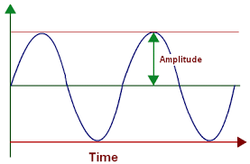
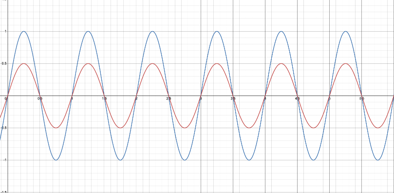
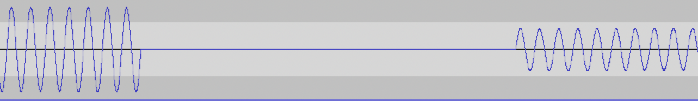
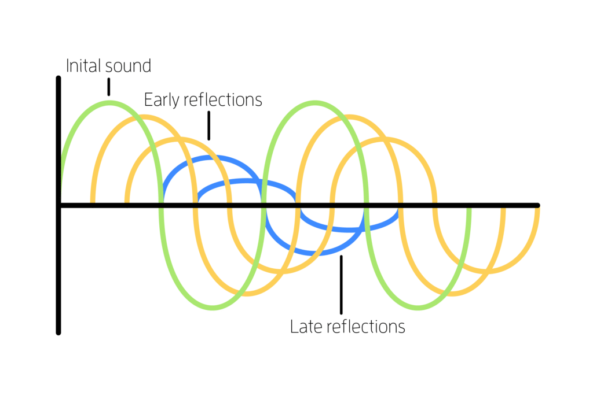
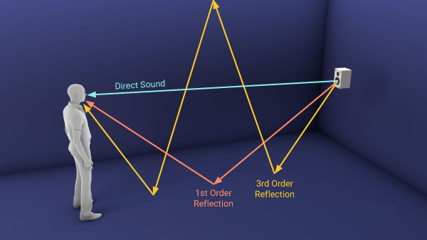
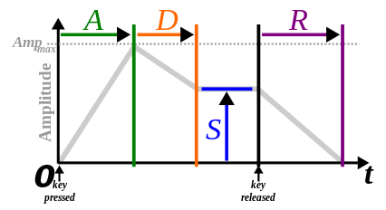

---

  

Table of Contents

  

- [1. Introduction](#1-introduction)

	- [A. Project description](#a-project-description)

	- [B. How it should be](#b-how-it-should-be)

	- [C. Compatibility Cross-platform](#c-compatibility-cross-platform)

- [2. Definitions of terms](#2-definitions-of-terms)

	- [A. Waves](#a-waves)

		- [a. Sine wave](#a-sine-wave)

		- [b. Square wave](#b-square-wave)

		- [c. Sawtooth wave](#c-sawtooth-wave)

		- [d. Triangle wave](#d-triangle-wave)

	- [B. Basic Filters](#b-basic-filters)

		- [a. Amplitude modification](#a-amplitude-modification)

		- [b. Overdriven](#b-overdriven)

		- [c. Echo](#c-echo)

		- [d. Reverb](#d-reverb)

		- [e. Flange](#e-flange)

	- [C. Advanced Filters](#c-advanced-filters)

		- [a. Low-Pass Filter](#a-low-pass-filter)

		- [b. High-Pass Filter](#b-high-pass-filter)

		- [c. low Frequency Oscillator](#c-low-frequency-oscillator)

	- [D. Envelope](#g-envelope)

		- [a. Attack](#a-attack)

		- [b. Decay](#b-decay)

		- [c. Sustain](#c-sustain)

		- [d. Release](#d-release)

- [3. Users](#3-users)

	- [A. Who](#a-who)

	- [B. Why](#b-why)

- [4. Userflow](#4-userflow)

	- [A. How to use it](#a-how-to-use-it)

	- [B. Generic Code example](#b-generic-code-example)

		- [a. Generate a simple note](#a-generate-a-simple-note)

		- [b. Apply an echo to the previous note](#b-apply-an-echo-to-the-previous-note)

		- [c. Remove low frequency from a sound](#c-remove-low-frequency-from-a-sound)

- [5. Out of Scope](#5-out-of-scope)

	- [A. Interface](#a-interface)

	- [B. Android Compatibility](#b-android-compatibility)

	- [C. IOS Compatibility](#c-ios-compatibility)

	- [D. Keyboard in interface to play as a Piano](#d-keyboard-in-interface-to-play-as-a-piano)

  
  
  
  

---

  

# 1. Introduction

## A. Project description

The aim of this project is to create a sound synthesizer that can be used to create programmable music. This project was inspired by [Sonic Pi](https://sonic-pi.net/) and other live coding music packages. The ultimate aim of this project is to be able to play music from code.

&nbsp;

## B. How it should be

As it should be able to be used in another program, it should be an API, a Librairy or a Package.
It should have basic functions to generate sound based on differents options, like possibility to use note or pur frequency to generate a sound.

&nbsp;

## C. Compatibility Cross-platform

The program have to be available and usable on MacOS and Windows.

&nbsp;

# 2. Definitions of terms

## A. Waves

Any sounds correspond to a wave. A wave that make fluid (Mainly Air for sound) vibrate and produce earable sound.
It exist 4 type of waves, Sine, Square, Triangle, Sawtooth.
Each wave produce a different type of sound.
For all waves, a few technicals terms come along:

- Frequency = The pitch of a sound

- Period = Time needed to reproduce the same pattern in a wave

- Fundamental = Main note of a sound, a Sine is special as it's only the fundamental note

- Harmonics = Fundamental or main pitch or note, plus they have higher pitches that are voiced above the fundamental.

### a. Sine wave


The most basic and simple waveform, a sine wave has a simple hollow sound. It does not exist in nature, but is the simplest sound to reproduce with electronics.

The sine wave have a well know formula:

`y(x)=A * sin(2π * f)`

- Where A = amplitude of the sound, How high the curve will go

- Where f = Frequency of the sound, How high the sound will be

- Where 2π = Constant for the Period, modified directly because of the frequency

&nbsp;

&nbsp;

### b. Square wave


The square wave has only odd harmonics. This harmonic structure gives the square wave a little more bite to the sound. It kind of has a buzzing sound, but is not as intense as the sawtooth.

&nbsp;

&nbsp;

### c. Sawtooth wave


The sawtooth produces a lot of harmonic content and therefore a full buzzing sound. Notice how the wave looks like the teeth of a saw, hence the name.

### d. Triangle wave


A triangle wave have the property of a sine wave and a square wave combined.

It still a little bit buzzy because of the square wave property, and at the same time still clear and constant sound because of sine properties

&nbsp;

&nbsp;

## B. Basic Filters

### a. Amplitude modification

The amplitude of a wave is the high of the curve will be.



The modification of the wave's amplitude will modify the power of the sound.
On the image below the blue wave has an amplitude of 1 and the red one has an amplitude of 0,5.



### b. Overdriven

The overdriven effect is to cut off the wave at specific amplitude.


### c. Echo

The echo effect return the same wave with a different amplitude and with a delay that the user will choose.



### d. Reverb

The reverb effect will be applied to a sound to simulate reverberation.



Reverberation is a persistence of sound, or echo after a sound is produced.



### e. Flange

Flanging is an audio effect produced by mixing two identical signals together, one signal delayed by a small and gradually changing period, usually smaller than 20 milliseconds.
The user will can choose the delay.

## C. Advanced Filters

### a. Low-Pass Filter

A low-pass filter is a filter that lets through signals with a lower frequency than the one selected by the user. It will therefore attenuate signals with a higher frequency than the one selected.

### b. High-Pass Filter

A high-pass filter is a filter that lets through signals with a higher frequency than the one selected by the user. It therefore attenuates signals with a lower frequency than the one selected.

### c. Low Frequency Oscillator

A Low Frequency Oscillator (or LFO) is an oscillator that produces the four waveforms at a very low frequency or pitch. The interest of having slow vibrations (0 to 20 Hz approximately) is to modulate a parameter in a synth in order to create audio effects like vibrato (musical effect consisting of a regular, pulsating change of pitch) or tremolo (is a trembling effect).

## D. Envelope

An envelope describes how a sound changes over time. It allow to module the sound of each note.
The user will be able to control the form of the envelope with 4 parameters: Attack, Decay, Sustain and Release.


  
### a. Attack

The attack describes the time it takes to reach the maximum level, after the start of the note.

### b. Decay

The decay indicates the time required to descend to the maintenance phase.

### c. Sustain

The sustain describes the stable level, maintained as long as the key is held down.

### d. Release

The release indicates the duration necessary for the level to decrease until returning to the initial zero, starting from the end of the note.

# 3. Users

## A. Who

The program will be designed to be used by devellopers or Sound artist with some knowledge of code.

&nbsp;

## B. Why

It's a librairy / API so a basic fan of sound won't be able to use that.
You will need to first learn coding before being able to use this program.
It doesn't have have UI so it won't be casual user friendly.

# 4. Userflow

## A. How to use it

You should be able a create a sound using Notes
Here is a simple example on how the program should be used

```FSHARP
let note length note octave =
 Creation.makeNote Creation.sine length note octave
 |> Envelope.apply 0.9 0.5 0.1 0.4
 |> Filter.echo 0.4

let halfNote = note 0.5
let quaterNote = note 0.25
let eightNote = note 0.125

let tune =
 seq { quaterNote Note.B 4
   quaterNote Note.B 4
   eightNote Note.B 4
   eightNote Note.B 4
   eightNote Note.C 4
   eightNote Note.D 4
   halfNote Note.D 4
   quaterNote Note.D 4
   eightNote Note.D 4
   eightNote Note.C 4
   eightNote Note.C 4
   eightNote Note.B 4 }
  |> Filter.applyFunction (Filter.lfo 0.6)

// play the tune
let player = Player.Play(tune, Repeat = true)
```

## B. Generic Code example

### a. Generate a simple note

Here is a example of a simple note generation

```FSHARP
let note length note octave =
 Creation.makeNote Creation.sine length note octave

let halfNote = note 0.5
let quaterNote = note 0.25
let eightNote = note 0.125

let tune =
 seq { quaterNote Note.B 4 }

// play the tune
let player = Player.Play(tune, Repeat = true)
```

It simply create a sound with note B at octave 4 and play it. No filters are apply in any form, and the sound generated correspond to a Sine.

&nbsp;

### b. Apply an echo to the previous note

Now let's apply a filter to our previous note.

```FSHARP
let note length note octave =
 Creation.makeNote Creation.sine length note octave
 |> Filter.echo 0.4

let halfNote = note 0.5
let quaterNote = note 0.25
let eightNote = note 0.125

let tune =
 seq { quaterNote Note.B 4 }

// play the tune
let player = Player.Play(tune, Repeat = true)
```

We have the same way to create a note, but we add the fact that this note is going to have a little bit of echo, others filters (See previously) are available the same way.

&nbsp;

### c. Remove low frequency from a sound

And last part, we need to be able to apply a filter ( LFO ) to the whole sound instead of only 1 note.

```FSHARP
let note length note octave =
 Creation.makeNote Creation.sine length note octave
 |> Filter.echo 0.4

let halfNote = note 0.5
let quaterNote = note 0.25
let eightNote = note 0.125

let tune =
 seq { quaterNote Note.B 4 }
  |> Filter.applyFunction (Filter.lfo 0.6)

// play the tune
let player = Player.Play(tune, Repeat = true)
```

# 5. Out of Scope

## A. Interface

We wanted to create a graphical interface to make our code more visual and user firendly. We didn't do it because we were asked to create a library and an graphical interface would have been useless.

## B. Android Compatibility

An Android compatibility was a part of our out of scope, that could have allowed us to use our code as an application on Android system but we didn't do it because we have to create a library and this would be useless. Also, we don't have enough time to address this issue and we don't have enough capacities too.

## C. iOS Compatibility

An iOS compatibilty could have allowed us to use our code as an application on iPhone or iPad system. We didn't do it because we have to create a library and this would be useless. Also, work on iOS system is hard and we don't have enough capacities and we don't have enough time to address this issue.

## D. Keyboard in interface to play as a Piano

We thought about create a keyboard in the interface to play as a piano (each key correspond to a note and make a sound) but we didn't do it because we were asked to create a library and this would be useless. Also, we don't have enough time to adress this issue.