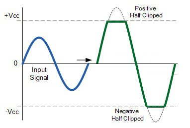

# Technical

Table of Contents
- [Technical](#technical)
  - [1. Introduction](#1-introduction)
    - [A. Project description](#a-project-description)
    - [B. How it should be](#b-how-it-should-be)
  - [2. Development rules](#2-development-rules)
    - [A. Technologies used](#a-technologies-used)
      - [a. Type of needs](#a-type-of-needs)
      - [b. Language used](#b-language-used)
    - [B. Formating](#b-formating)
    - [C. Compatibility](#c-compatibility)
  - [3. Possible issues](#3-possible-issues)
    - [A. Compatibility](#a-compatibility)
    - [B. Team Leaving](#b-team-leaving)
    - [C. Knowledge](#c-knowledge)
  - [4. Team](#4-team)
  - [5. Regroup](#5-regroup)
    - [A. Namespaces](#a-namespaces)
    - [B. Modules](#b-modules)
      - [a. NoteToHz](#a-notetohz)
      - [b. WaveGen](#b-wavegen)
      - [c. Filters](#c-filters)
      - [d. save](#d-save)
      - [e. PlaySynth](#e-playsynth)
  - [6. Functions](#6-functions)
    - [A. NoteToHz](#a-notetohz-1)
      - [a. convert](#a-convert)
      - [b. noteListToFloatList](#b-notelisttofloatlist)
    - [B. WaveGen](#b-wavegen-1)
      - [a. calcSin](#a-calcsin)
      - [b. calcSquare](#b-calcsquare)
      - [c. calc Tri](#c-calc-tri)
      - [d. calcSaw](#d-calcsaw)
    - [C. Filters](#c-filters-1)
      - [a. amplitude](#a-amplitude)
      - [b. overdriven](#b-overdriven)
      - [c. flange](#c-flange)
      - [d. echo](#d-echo)
      - [e. reverb](#e-reverb)
      - [f. chords](#f-chords)
    - [D. Spectroscope](#d-spectroscope)
      - [a. Low pass](#a-low-pass)
      - [b. High pass](#b-high-pass)
      - [c. Both pass](#c-both-pass)
    - [E. Low Frequency Oscilliator](#e-low-frequency-oscilliator)
      - [a. Frequency modulation](#a-frequency-modulation)
      - [b. Amplitude modulation](#b-amplitude-modulation)
      - [c. Both modulation](#c-both-modulation)
    - [F. save](#f-save)
      - [a. sample](#a-sample)
      - [b. floatToByte](#b-floattobyte)
      - [c. write](#c-write)
    - [G. PlaySynth](#g-playsynth)
      - [a. playSound](#a-playsound)


## 1. Introduction

### A. Project description

The aim of this project is to create a sound synthesizer that can be used to create programmable music. This project was inspired by [Sonic Pi](https://sonic-pi.net/) and other live coding music packages. The ultimate aim of this project is to be able to play music from code.
By synthesizer it means a simple library who could be used by other programs. 
This isn't a program specially designed to be used for a traditional piano keyboard.


### B. How it should be

Need to be a library with all function callable from another program. 

## 2. Development rules


### A. Technologies used
#### a. Type of needs

| What ?  | Which ? | Why ? |
| :--------------- |:---------------:|---------------:|
| Code editor      | Any ( Visual Studio Code adviced) | / |
| Sound Playing | [SMFL Library](https://www.sfml-dev.org/) | MacOS + Windows Compatibility |
| Waves display  | [xPlot](https://github.com/fslaborg/XPlot) | Used by Google Chart |
| Math calculation | [Math net](https://numerics.mathdotnet.com/) | Support Linear Algebra |
| Github | [Repository](https://github.com/Clementine951/ALGOSUP_2022_Project_3_D) | Code |
| Trello | [Trello](https://trello.com/invite/b/Dlhygf5L/56e58689f9569317c5e523aa5f6a8c66/algosup2022project3d) | Project progression |
| Slack | [Slack](https://join.slack.com/t/algosupstudents/shared_invite/zt-121i5fkhh-A8xHt0dh7M~HSdQsQ151Cw) | Project Communication |


#### b. Language used

Although F# is great for specialist areas such as scientific or data analysis, it is also an excellent choice for enterprise development. 
Since we need to process lot of data with lot of list of Float ( Result of Sin(x) ), F# seems to be a good choice for that task.
It's also a Dotnet language, so it is available on Mac and Windows. 
And have a lot of library available because of Dotnet.

### B. Formating

| Type  | Format |
| :--------------- |:---------------:|
| Namespace | Camelcase |
| Module | Camelcase |
| Function  | Pascalcase |
| Variable | Pascalcase |


### C. Compatibility

SFML, Visual Studio, xPlot, Math.Net are compatible on Windows and MacOS.


## 3. Possible issues
### A. Compatibility

For the moment, all library used are compatible on Windows, Linux and MacOS.
We shouldn't have issue on those plateform, but most of them aren't compatible on Android and IOS.

### B. Team Leaving

If we have someone leaving the team, someone else will be able to take his work. 
In order to do that, there will be at least 2 people on each parts. 
Also we ask everyone to push they're work everyday so we don't loose any work done.

### C. Knowledge

Nobody in the team knows about FSharp, that's why it's the main problem.
Here is an exhaustive list of website to use: 

- [Stack Overflow](https://stackoverflow.com/)
- [FSharp Documentation](https://docs.microsoft.com/en-us/dotnet/fsharp/)
- [Dotnet Documentation](https://docs.microsoft.com/en-us/dotnet/)


## 4. Team

We are currently a team of 6.

- **Clémentine Curel** Team Lead
- **Guillaume Rivière** Tech Lead
- **Laura-Lee Hollande** Contributor
- **Salaheddine Namir** Contributor
- **Gaël Le Brun** Contributor
- **Victor Leroy** Contributor

## 5. Regroup
### A. Namespaces

`namespace synthesizer` Since the project doesn't seems to be a large thing, it got decided to use only 1 namespace for the whole project.

### B. Modules
#### a. NoteToHz

`module NoteToHz =` will handle the conversion from readable notes ( A, B, Etc) to actual Frequency.


#### b. WaveGen

`module WaveGen =` will handle the creation of the base of a sound, with Sine, Square, Triangle and Saw waves.

#### c. Filters

`module Filters =` will handle the filters like Echo, Flange, LFO, etc.

#### d. save

`module Save =` will have all functions for saving to **.wav** and **.mp3**.

#### e. PlaySynth

`module PlaySynth =` will have the sound player ( using SFML library ).

## 6. Functions
### A. NoteToHz
#### a. convert

```FSHARP
let convert note octave = 
        let noteHz =
            match note with
            | "C" -> 16.35
            | "C#" -> 17.32
            | "D" -> 18.35
            | "D#" -> 19.45
            | "E" -> 20.60
            | "F" -> 21.83
            | "F#" -> 23.12
            | "G" -> 24.5
            | "G#" -> 25.96
            | "A" -> 27.5
            | "A#" -> 29.14
            | "B" -> 30.87
            | _ -> 0.

        let result = noteHz * (2. ** octave)
        result
```

We first do a list of all notes, and match the given notes with existing ones. Then we multiply by the octave. 
The formula pour the octave is `x * (2^octave)`, for example, a **C4** Wich is note C on octave 4 is, `16.35 *2 *2 *2 *2` that can also be writen `16.35 * 2^4`.

#### b. noteListToFloatList

```FSHARP
let noteListToFloatList (inputNote:(NOTE * OCTAVE * AMPLITUDE * PLAYTIME)[]) (sampleRate:float) =
        let listNormalWave = [
            for i = 0 to inputNote.Length-1 do
                let tmp = 
                    WaveGen.calcSin sampleRate PLAYTIME (convert NOTE OCTAVE) AMPLITUDE
                yield tmp
        ]
        let normalWave = List.concat listNormalWave
        normalWave
```
If you want to play mutiple notes in a row, you need something to do that.
So this function take a list of notes as input in addition to the samplerate, and output a list of float, with multiple notes.

### B. WaveGen
#### a. calcSin
`let calcSin sampleRate time freq amp=`

In order to calculate a wave designed for the sound you need at least 4 values.
  sampleRate = the quality of the sound
        time = how long the wave have to be
        freq = the pitch of the note, or commonly called Frequency
         amp = amplitude, of the volume, how high the wave will go

Based on that we can have to formula for a Sine wave:

$
f(y) = amp * sin(2 * π * freq * x) 
$

#### b. calcSquare

`let calcSquare sampleRate time freq amp=`

In order to calculate a wave designed for the sound you need at least 4 values.
  sampleRate = the quality of the sound
        time = how long the wave have to be
        freq = the pitch of the note, or commonly called Frequency
         amp = amplitude, of the volume, how high the wave will go

Based on that we can have to formula for a Square wave:

$
f(y) = amp *  sign( sin (2 * π * freq * x))
$

sign() is a function that set a value to 1 if it's over 0 and set the value to -1 if it's under 0.
So we need to generate a sine and apply a sign to it in order to have a square.

#### c. calc Tri

`let calcTri sampleRate time freq amp=`

In order to calculate a wave designed for the sound you need at least 4 values.
  sampleRate = the quality of the sound
        time = how long the wave have to be
        freq = the pitch of the note, or commonly called Frequency
         amp = amplitude, of the volume, how high the wave will go

Based on that we can have to formula for a Square wave:

$
f(y) = amp * 2. * asin (sin (2. * π * freq * x)) / π )
$

asin(sin(x)) is used to generate triangle. and then we apply other parameters in order to be able to change the shape of the wave.
We also have to mutiply the amp by 2 because we no longer have 1 trigonometrical call, but 2 ( asin and sin).

#### d. calcSaw

`let calcSaw sampleRate time freq amp=`

In order to calculate a wave designed for the sound you need at least 4 values.
  sampleRate = the quality of the sound
        time = how long the wave have to be
        freq = the pitch of the note, or commonly called Frequency
         amp = amplitude, of the volume, how high the wave will go

Based on that we can have to formula for a Square wave:

$
f(y) = amp * 2. * (x * freq - floor(0.5 + x * freq))
$

This one is a bit tricky and use something that is reserved to digital sound.
All points of the wave have to be between **-1** and **1**.
When a point is over 1 it automatically go to -1, and so on.

This function use that feature, (See below) to have a clear wave that looks like a saw.


### C. Filters

All filters are here to bring modifications to the base wave generated by functions above.
Everything that change the shape of the wave is considered as a filter.
A sound is always only one wave, so even adding 2 sound together is considered as a filter.

#### a. amplitude

```FSHARP
let amplitude initialList amp =
  let returnList = List.map (fun x -> x*amp) initialList
  returnList
```

We need a function to change the amplitude without have to re-create a wave.
It's mainly used by other filter, i think of Echo that will rely on this amplitude modification.
On so doing that way, values over **1** will make bigger numbers, while value under **1** will lower values. 

#### b. overdriven



```FSHARP
let overdriven list amp =
  let lenght = list.Length
  let returnList = [
    for i in 0..lenght-1 do 
      if list.[i]>= amp then amp
      elif list.[i]<= (-amp) then (-amp) 
      else list.[i]
  ]
  returnList
```

Pretty simple function just to limit value that are higher than a specified amplitude.

#### c. flange

```FSHARP
let flange wave =
  let lenght = wave.Length
  let subWave = [for i in 0..lenght-1 do wave.[i] * -1.]
  subWave
```

A flange effect is that same sound but reverted upside down, so multiplying all value by -1 invert all the wave.

#### d. echo

```FSHARP
let echo initialList delay amp repeat =
  let tmpList = WaveGen.calcSin 44100. delay 0. 0. 
  let returnFullList = [
      yield initialList
      for i = 1 to repeat do
          let returnList = tmpList + (amplitude initialList ( amp / i)) 
          yield returnList
  ]
  let returnFullList = List.concat returnFullList
  returnFullList
```


So the way we build echo is like an addition, `Sound + Silence + Reduced sound + Silence + Etc `
That is why a for loop based on the number of repeat each iterate is **Silence + Sound**


#### e. reverb
#### f. chords

```FSHARP
let chords wave1 wave2 =
  let sumList = List.map2 (fun x y -> (x + y)/2.) wave1 wave2
  sumList
```

Chord filter goal is to be able to add two waves together, so it is kinda easy on how it works.

### D. Spectroscope

```FSHARP
    let spectroscope (list:float list) =
       
       let lenght = list.Length
       let mutable trig = 0
       let mutable t = 0.
       let mutable check = 0.
       
       let periode = // find period of list
           for i in 0..lenght-1 do
               if i < lenght-1 && i > 0 then
                if trig >= 1 && trig <= 2 then
                    t <- t + 0.0001
                if trig = 2 then
                    trig <- trig + 1
                   
                  elif list.[i] > list.[i+1] && list.[i] >= list.[i-1] then
                    
                    trig <-trig + 1
                    check <- check + list.[i] - check

                    if check > list.[i] then // trig work only  highest value
                     trig <- trig - 1
           t  
       let getFrequency =
        1./ periode
       getFrequency
```

Spectroscope goal is to find the frequency of the wave so it can then be used in low pass and high
pass filters.

#### a. Low pass 

```FSHARP
 let lowPass (list: float list, fcut: float, order: int) = // return list with Lowpass Filter
        let fs = spectroscope(list)
        let lowPass =  OnlineFilter.CreateLowpass(ImpulseResponse.Finite,fs,fcut,order)
        let array = list |> List.toArray
        let filtered = array |> lowPass.ProcessSamples
        let reList = filtered |> Array.toList
       // printfn"list %A" list
       // printf"lowPass %A" reList
        reList 
```

Low pass filter goal is to cut-off all the sounds with a frequecy higher than 5 kHz.

#### b. High pass

```FSHARP
let highPass (list: float list, fcut: float, order: int) = // return list with Highpass Filter
        let fs = spectroscope(list)
        let highPass =  OnlineFilter.CreateHighpass(ImpulseResponse.Finite,fs,fcut,order)
        let array = list |> List.toArray
        let filtered = array |> highPass.ProcessSamples
        let reList = filtered |> Array.toList
       // printfn"list %A" list
       // printf"highPass %A" reList
        reList
```

High pass filter goal is to cut-off all the sounds with a frequency lower than 500 Hz.

#### c. Both pass

```FSHARP
let BothPass (list: float list, fcut: float, order: int) = // return both filters at the same time
        let pass = LowPass (list, fcut, order)
        let bothPass = HighPass (pass, fcut, order)
        bothPass
```

Both Pass function calls our two filters previously presented, it's goal is to have only sounds with a
frequency between 500 Hz and 5 kHz.

### E. Low Frequency Oscilliator

#### a. Frequency modulation

#### b. Amplitude modulation

#### c. Both modulation


### F. save

The save module is made to regroup all saving related function.

#### a. sample

```FSHARP
let sample x = (x + 1.)/2. * 255. |> byte
```

This function is quite simple, but achieve a lot of work.
Since now we were working with list of float **between -1 and 1**, now we need to work with **bytes**.
Bytes are value from **0 to 255**, and this simple function do the calculation to convert a float between -1 and 1 to a Byte.

#### b. floatToByte

```FSHARP
let floatToByte wave =
  let data = wave
              |> List.map sample 
              |> Microsoft.FSharp.Collections.List.toArray
  data
```

As we can't write a list on a file, we have to convert it to an Array. 
Before converting to an array, it call the function above to convert all data to bytes, then convert the list to an Array.
And return the array generated.

#### c. write

```FSHARP
let write stream data =

  let data = floatToByte data

  use writer = new BinaryWriter(stream)
  // RIFF
  writer.Write("RIFF"B)
  let size = 36 + data.Length in writer.Write(size)
  writer.Write("WAVE"B)
  // fmt
  writer.Write("fmt "B)
  let headerSize = 16 in writer.Write(headerSize)
  let pcmFormat = 1s in writer.Write(pcmFormat)
  let mono = 1s in writer.Write(mono)
  let sampleRate = 44100 in writer.Write(sampleRate)
  let byteRate = sampleRate in writer.Write(byteRate)
  let blockAlign = 1s in writer.Write(blockAlign)
  let bitsPerSample = 8s in writer.Write(bitsPerSample)

  writer.Write("data"B)
  writer.Write(data.Length)
  writer.Write(data)
```

Let's process parts by parts:

First, the Parameters, Stream and data.
Stream is the name of the file we want.
data is the List of numbers generated by other functions.

Second, The conversion:
`let data = floatToByte data`
We just call the function detailed a few lines above

Third, the Header

```FSHARP
  use writer = new BinaryWriter(stream)
  // RIFF
  writer.Write("RIFF"B)
  let size = 36 + data.Length in writer.Write(size)
  writer.Write("WAVE"B)
  // fmt
  writer.Write("fmt "B)
  let headerSize = 16 in writer.Write(headerSize)
  let pcmFormat = 1s in writer.Write(pcmFormat)
  let mono = 1s in writer.Write(mono)
  let sampleRate = 44100 in writer.Write(sampleRate)
  let byteRate = sampleRate in writer.Write(byteRate)
  let blockAlign = 1s in writer.Write(blockAlign)
  let bitsPerSample = 8s in writer.Write(bitsPerSample)
```
In a **.wav** file there is a header that regroup all needed informations for be playing, or imported after that.
We create an object `writer` that will allow us to access the file.
Then we write some default value, and then our value.
By our data, i mean our Header Data, stuff like, Mono/Stereo, Samplerate, bitsPerSample, etc.

And in fourth, we write our actual sound:

```FSHARP
  writer.Write("data"B)
  writer.Write(data.Length)
  writer.Write(data)
```

We first write a default value, then the length, and finally the sound itself.


### G. PlaySynth

As we are going to use **SFML library** in order to play sound, this part is short, and easy.

#### a. playSound


```FSHARP
let playSound (name:string,save:bool,time:float32) = 
  let buffer = new SoundBuffer(name) 
  let sound = new Sound(buffer) 
  let times = Time.FromSeconds(time) 
  sound.set_PlayingOffset(times)
  sound.Play()

  while sound.Status = SoundStatus.Playing do
      Thread.Sleep(100)

  if (save=false) then System.IO.File.Delete(name)
```

That is code made out of documentation we found about SFML.
We import the buffer and the sound, then the Time to start the sound.
Set when exactly the sound have to start.
And Play it.

The while loop is essentially, otherwise, the programm would close before finishing to play, 
So while the sound isn't finished, it idle for **100 ms**.

And the last part is a trick to play without saving the file.
Well not a long term save, basically the simplest way to play a sound without saving, is to actually save it, play it, then delete it. That what we are going to do.

